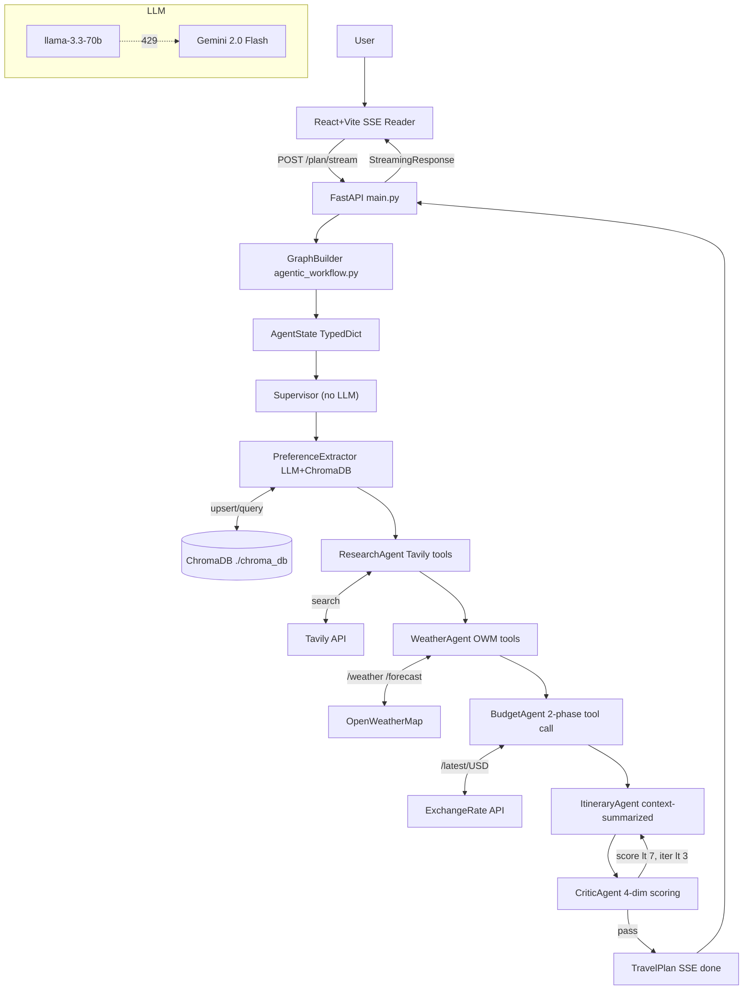

# WanderBot — Interview Preparation Roadmap

> **Purpose:** A compact syllabus to study and defend this project in an interview.
> Every claim is verified from source code. Unverified items are marked **[NV]**.

---

## 1. Project Fundamentals

### Problem & Motivation
Travel planning requires cross-referencing multiple sources (maps, weather, currency, reviews).
WanderBot automates the entire research-to-itinerary pipeline via a team of specialized AI agents.
Core insight: a single LLM prompt cannot reliably do math, fetch live data, AND produce a structured plan without hallucinations. Specialization solves this.

### Features (verified from code)
- 7-agent deterministic linear pipeline
- Automated critic/reflection loop (max 3 revisions)
- Dual-LLM fallback (Groq primary → Gemini 2.0 Flash on 429)
- Long-term memory via ChromaDB (vector search)
- Short-term state via LangGraph MemorySaver
- Real-time SSE streaming (node-by-node progress)
- Two frontends: React+Vite (primary), Streamlit (prototype)
- Pydantic v2 schemas with type-coercion validators

### NOT in the codebase (verified absent)
- Google Places API (commented out in `place_info_search.py`)
- TTS, authentication, booking APIs, unit tests, Docker

### User Flow
1. User types query in React UI
2. Frontend POSTs to `/plan/stream` with a fresh UUID thread_id
3. FastAPI streams SSE events as each agent node completes
4. Final `TravelPlan` JSON sent on "done" event
5. React renders PlanCard with itinerary, budget bar, critic review
6. Preferences saved to ChromaDB for future personalization

### My Contribution (`setup.py` author: mradul mahajan)
- Designed 7-node LangGraph pipeline topology
- Built `invoke_with_fallback` LLM fallback mechanism
- Implemented ChromaDB long-term memory RAG layer
- Designed all Pydantic schemas with field validators
- Built SSE streaming endpoint + React SSE consumer
- Refactored from dynamic routing to deterministic pipeline

### Tech Stack

| Layer | Technology | Purpose |
|---|---|---|
| Frontend | React 19 + Vite 8 | SSE-consuming chat UI |
| Prototype UI | Streamlit | Quick demo interface |
| Backend | FastAPI + Uvicorn | Async API + SSE streaming |
| Orchestration | LangGraph (StateGraph) | Multi-agent state machine |
| LLM Primary | Groq llama-3.3-70b-versatile | Fast inference, temp=0 |
| LLM Fallback | Google Gemini 2.0 Flash | Failover on 429 rate limit |
| LangChain | Core + Community + integrations | LLM chains, tools, messages |
| Vector DB | ChromaDB (local persistent) | Long-term preference RAG |
| Session State | LangGraph MemorySaver | In-process checkpointing |
| Place Search | Tavily Search API | Real-world place data |
| Weather | OpenWeatherMap API v2.5 | Live weather + forecast |
| Currency | ExchangeRate-API v6 | Live FX conversion |
| Schemas | Pydantic v2 | Typed inter-agent contracts |
| Packaging | uv + setuptools | Fast dep management |
| Linting | oxlint (frontend) | JS/JSX linting |
| Logging | Python stdlib logging | Stdout structured logs |

---

## 2. Architecture

### Pipeline (deterministic linear + one conditional loop)
```
START
  Supervisor          (no LLM; extracts query string from messages)
    PreferenceExtractor  (LLM -> UserPreferences; ChromaDB RAG)
      ResearchAgent    (LLM + tools -> places & restaurants)
        WeatherAgent (LLM -> WeatherInfo; OWM tools defined but not bound [NV])
          BudgetAgent (2-phase: tool-call -> structured output -> BudgetBreakdown)
            ItineraryAgent (LLM -> List[DayPlan]; uses context_summarizer)
              CriticAgent  (LLM -> CriticReview; scores 0-10 on 4 dimensions)
                score < 7.0 AND iteration < 3 -> back to ItineraryAgent
                score >= 7.0 OR iteration >= 3 -> END
```

### Architecture Diagram (Mermaid)


### End-to-End Request Lifecycle
1. React: `crypto.randomUUID()` -> POST `/plan/stream` `{question, thread_id, remember_me:true}`
2. FastAPI: `event_generator()` starts; `GraphBuilder().build_graph()` compiles graph with MemorySaver
3. `graph.stream({messages:[question]}, config)` yields `{node_name: node_state}` for each node
4. **Supervisor**: reverses messages, extracts last non-empty string -> `state["query"]`
5. **PreferenceExtractor**: `retrieve_past_trips(query)` -> ChromaDB -> inject as context -> `invoke_with_fallback(llm.with_structured_output(UserPreferences), messages)` -> `UserPreferences`
6. **ResearchAgent**: `llm.bind_tools(tavily_tools).with_structured_output(ResearchOutput)` -> places + restaurants (LLM uses knowledge; tool execution loop not implemented)
7. **WeatherAgent**: `llm.with_structured_output(WeatherInfo)` -> WeatherInfo (OWM tools defined but NOT bound to chain - LLM uses seasonal knowledge)
8. **BudgetAgent Phase 1**: `llm.bind_tools(calc+currency)` -> LLM returns `tool_calls` -> code executes each -> appends `ToolMessage`. **Phase 2**: `llm.with_structured_output(BudgetBreakdown)` on updated message history
9. **ItineraryAgent**: `summarize_for_itinerary()` compresses context -> LLM generates `List[DayPlan]`; if `critic_review.requires_revision`, revision instructions appended
10. **CriticAgent wrapper**: scores -> code overrides `requires_revision` (`overall_score < 7.0`) -> increments `iteration_count` -> `reflection_router()` decides
11. Loop (max 3x) or END
12. `graph.get_state(config).values` -> assemble `TravelPlan` -> `LongTermMemory.save_preferences()`
13. `format_sse_event("done", data=TravelPlan)` -> React `setPlan(data)` -> renders PlanCard

---

## 3. Implementation

### Key Files

| File | What it does | Why it exists |
|---|---|---|
| `agent/agentic_workflow.py` | AgentState, reducers, GraphBuilder, reflection_router | Central graph topology |
| `agent/supervisor.py` | Extracts query from messages; no LLM | Entry point; query normalization |
| `agent/preference_extractor.py` | Query -> UserPreferences; reads ChromaDB | Structured preference extraction |
| `agent/research_agent.py` | Generates ResearchOutput (places, restaurants) | Destination research |
| `agent/weather_agent.py` | Generates WeatherInfo | Weather-aware planning |
| `agent/budget_agent.py` | 2-phase tool-call -> BudgetBreakdown | Accurate budget with real FX |
| `agent/itinerary_agent.py` | Synthesizes all data -> List[DayPlan] | Day-by-day plan generation |
| `agent/critic_agent.py` | Scores itinerary; triggers revision loop | Quality gate |
| `utils/llm_loader.py` | `invoke_with_fallback` + `_sanitize_messages` | **Core LLM reliability layer** |
| `utils/streaming.py` | `format_sse_event()` -> SSE string | FastAPI-to-React event formatting |
| `utils/context_summarizer.py` | Compresses research/weather/budget to ~20 lines | Token optimization |
| `utils/retry.py` | Exponential backoff decorator (sync + async) | Resilient external API calls |
| `utils/place_info_search.py` | TavilyPlaceSearchTool with 4 query types | Wraps Tavily; Google Places commented out |
| `utils/weather_info.py` | WeatherForecastTool wrapping OWM endpoints | Live weather HTTP client |
| `utils/currency_converter.py` | CurrencyConverter using ExchangeRate-API v6 | Live FX rates |
| `utils/expense_calculator.py` | Calculator: multiply, sum, daily budget | Deterministic arithmetic |
| `memory/long_term.py` | LongTermMemory: ChromaDB upsert + query | Cross-session personalization |
| `memory/short_term.py` | ShortTermMemoryManager: MemorySaver singleton | In-session state checkpointing |
| `models/schemas.py` | All Pydantic v2 models + field validators | Typed inter-agent contracts |
| `main.py` | FastAPI app: /plan, /plan/stream, /graph | Backend entry point |
| `streamlit_app.py` | Streamlit SSE consumer UI | Prototype frontend |
| `frontend/src/App.jsx` | React SSE consumer; state management | Production frontend |
| `prompt_library/*.py` | System prompts per agent | Prompt separation from logic |
| `tools/*.py` | LangChain @tool wrappers around utilities | LLM-callable tool definitions |

### Key Classes & Functions

| Symbol | File | Role |
|---|---|---|
| `AgentState` (TypedDict) | agentic_workflow.py | Shared state: 13 fields, annotated with reducers |
| `_union_list` reducer | agentic_workflow.py | Dedup accumulator for completed_agents, failed_agents |
| `append_history` reducer | agentic_workflow.py | Append-only for revision_history |
| `critic_agent_wrapper` | agentic_workflow.py | Wraps critic node; increments iteration_count |
| `reflection_router` | agentic_workflow.py | Conditional edge: "ItineraryAgent" or END |
| `GraphBuilder.build_graph()` | agentic_workflow.py | Compiles StateGraph with MemorySaver checkpointer |
| `invoke_with_fallback` | llm_loader.py | Tries Groq; on 429 sanitizes + retries with Gemini |
| `_sanitize_messages` | llm_loader.py | Strips empty HumanMessages (Gemini rejects them) |
| `summarize_for_itinerary` | context_summarizer.py | Top-5 places, top-3 restaurants, 1-line weather, budget total |
| `LongTermMemory.save_preferences` | long_term.py | ChromaDB upsert keyed by thread_id |
| `LongTermMemory.retrieve_past_trips` | long_term.py | Vector query; guards against empty collection |
| `get_checkpointer()` | short_term.py | Returns module-level MemorySaver singleton |
| `format_sse_event` | streaming.py | Returns "data: {json}\n\n" SSE string |
| `retry_with_backoff` | retry.py | Decorator: delay = base * 2^attempt; handles async too |

### APIs / Endpoints

| Endpoint | Method | Description |
|---|---|---|
| `/plan` | POST | Sync graph invocation; returns {thread_id, state} |
| `/plan/stream` | POST | **Production**: SSE stream of node events + final TravelPlan |
| `/graph` | GET | Returns LangGraph as PNG (draw_mermaid_png) |

### External API Calls

| API | Endpoint pattern | Used for |
|---|---|---|
| OpenWeatherMap | `/data/2.5/weather?q={city}` and `/data/2.5/forecast?q={city}&cnt=10&units=metric` | Current weather + 10-step forecast |
| ExchangeRate-API v6 | `/v6/{key}/latest/{from_currency}` | Currency conversion rates |
| Tavily Search | `TavilySearch(topic="general", include_answer="advanced")` | Place/restaurant/activity search |
| Groq | via `langchain_groq.ChatGroq` | Primary LLM inference |
| Gemini | via `langchain_google_genai.ChatGoogleGenerativeAI` | Fallback LLM inference |

### Pydantic Schemas (`models/schemas.py`)

| Model | Purpose | Notable detail |
|---|---|---|
| `UserPreferences` | Parsed query (10 fields) | `is_domestic` assumes India origin |
| `Place` | Attraction data | `entry_fee` coerces int/float -> "Rs.500" or "Free" |
| `Restaurant` | Dining data | All string fields |
| `Hotel` | Accommodation | `price_per_night`, `stars` coerce to str |
| `WeatherInfo` | Forecast data | `data_source`: "live_api" or "llm_fallback" |
| `BudgetBreakdown` | Cost summary | `is_within_budget` bool; `adjustment_suggestions` if over |
| `DayPlan` | One day of the trip | `estimated_day_cost` strips "Rs.2800 INR" -> 2800.0 |
| `CriticReview` | Quality scores | `requires_revision` set by code, not LLM |
| `RevisionRecord` | Loop history | iteration, score, changes_made |
| `TravelPlan` | Final output | Aggregates all agent outputs; `generated_at` auto-set |

### ChromaDB Schema
- **Collection**: `trip_preferences`
- **Document**: flat string — `"Destination: X. Style: Y. Interests: A,B. Budget: N. Duration: D days."`
- **Metadata**: `{thread_id, destination}`
- **ID**: `thread_id` (upsert semantics)
- **Embedding**: ChromaDB default (likely all-MiniLM-L6-v2) **[NV]**

---

## 4. Technology & Design Decisions

| Decision | Why Chosen | Alternative | Trade-off |
|---|---|---|---|
| LangGraph | Typed state machine; explicit loop control; native stream() | LangChain AgentExecutor | More code, but no infinite routing loops |
| Deterministic pipeline | Eliminated infinite routing loops & token bloat | Dynamic LLM routing | Cannot skip/reorder agents dynamically |
| Groq llama-3.3-70b | LPU speed, free tier, strong instruction following | OpenAI GPT-4o | Rate limits hit quickly; no vision |
| Gemini 2.0 Flash as fallback | Separate rate-limit bucket; free tier | Retry same Groq key | Adds Gemini-specific bugs (empty HumanMessage) |
| ChromaDB local | Embedded, no infra, free | Pinecone / pgvector | Not scalable; single-user only |
| MemorySaver | Zero config; sufficient for single-server | RedisSaver / PostgresSaver | Lost on restart; not multi-worker safe |
| SSE over WebSocket | Unidirectional; HTTP-native; simpler | WebSocket | No auto-reconnect in React (using Fetch not EventSource) |
| Fetch API over EventSource | EventSource only supports GET; endpoint is POST | N/A | No automatic reconnection |
| Pydantic with_structured_output | Auto-parses LLM JSON into typed models | Manual JSON parsing | Hides parse failures; harder to debug |
| context_summarizer.py | ~80% token reduction for ItineraryAgent | Pass raw JSON | Loses detail (descriptions, full packing list) |
| uv package manager | 10-100x faster than pip | pip / poetry | Fewer plugins/ecosystem tools |

---

## 5. Difficult / Important Concepts

### Programming
- **LangGraph reducers** (`add_messages`, `_union_list`, `append_history`): how partial state merges work
- **Annotated TypedDict**: why LangGraph requires type annotations on state fields
- **`chain_builder` pattern**: passing a lambda to reconstruct a chain with a different LLM
- **Pydantic `field_validator(mode="before")`**: runs before type coercion; used to normalize LLM output
- **Module-level singleton** (`_memory_manager_instance`): why MemorySaver must be shared across requests
- **`@tool` decorator**: converts Python function to LangChain StructuredTool with auto-generated schema

### Backend / API
- **FastAPI `StreamingResponse`**: keeps HTTP connection open; yields chunks from async generator
- **`async def event_generator()` + `graph.stream()` blocking**: stream() is synchronous inside async — blocks event loop; `graph.astream()` is the fix
- **CORS `allow_origins=["*"]`**: development convenience; security risk in production
- **Two-phase tool execution** (BudgetAgent): bind_tools -> execute manually -> structured output

### AI / LLM / Agents
- **Structured output** (`.with_structured_output(Schema)`): JSON mode + Pydantic parse; fails -> exception
- **`temperature=0.0`**: deterministic tokens; essential for reliable schema adherence
- **ReAct pattern** (BudgetAgent): Reason (tool selection) -> Act (execute) -> Observe (ToolMessage) -> Respond
- **Reflection loop**: CriticAgent scores -> revision instructions -> ItineraryAgent re-runs (max 3x)
- **RAG with ChromaDB**: embed query -> cosine similarity against stored trip docs -> inject top-2 as context
- **Business rule override in critic**: code sets `requires_revision` (not the LLM) to enforce threshold
- **CriticAgent failure-safe**: returns 7.5/10 pass score on exception — prevents orphaned revision loop

### Database / Memory
- **ChromaDB upsert vs add**: upsert overwrites same thread_id; add fails on duplicate
- **HNSW index**: approximate nearest neighbor; O(log n) vs O(n) brute force
- **`n_results` guard**: `min(n_results, collection.count())` prevents error on empty collection
- **No user isolation in ChromaDB**: all preferences in one collection — cross-user leakage risk

### Networking / Protocols
- **SSE format**: `data: {json}\n\n` — double newline is mandatory event delimiter
- **SSE vs WebSocket**: SSE = HTTP push, unidirectional; WS = bidirectional, separate handshake
- **`EventSource` limitation**: GET only — forced use of `fetch()` + `ReadableStream` for POST

### Security
- **Prompt injection**: user query goes directly into LLM prompts — no sanitization
- **Open CORS**: `allow_origins=["*"]` allows any origin to call the API
- **No auth / no rate limiting**: any client can exhaust API credits

### System Design
- **Singleton checkpointer**: must be shared; per-request MemorySaver breaks thread_id resolution
- **Stateless agents**: each node is a pure function; all state lives in `AgentState`
- **Token budgeting**: `summarize_for_itinerary` is the only explicit token management

---

## 6. Interview Question Bank

### Basic
- What is WanderBot? What problem does it solve?
- What is LangGraph? How is it different from LangChain Agents?
- What is a TypedDict and why does AgentState use it?
- What is Server-Sent Events? How is it different from WebSockets?
- What is ChromaDB used for in this project?

### Intermediate
- Explain the LLM fallback mechanism. *Hint: chain_builder lambda, 429 detection, _sanitize_messages*
- How does the CriticAgent reflection loop work? How do you prevent infinite loops?
- How does ChromaDB remember user preferences across sessions?
- Why does `MemorySaver` need to be a singleton?
- Walk me through BudgetAgent's two-phase tool calling.

### Advanced
- Does WeatherAgent actually call the OpenWeatherMap API? *Hint: tools defined but not bound to chain*
- Explain how LangGraph reducers work. What does `_union_list` do and why?
- `event_generator` is async but calls `graph.stream()` synchronously. What is wrong? How to fix?
- Why does the code override `requires_revision` even though the LLM already set it?
- What breaks if you create a new `MemorySaver()` per request?

### Code-Level
- Walk me through `invoke_with_fallback` line by line.
- What does `_sanitize_messages` do and why does it exist?
- Explain the `DayPlan.estimated_day_cost` validator. What input would break it?
- Why does `format_sse_event` use `model_dump(mode="json")` instead of `model_dump()`?
- Open `agentic_workflow.py`. Explain every `add_edge` and `add_conditional_edges` call.

### Architecture / System Design
- How would you scale WanderBot to 1,000 concurrent users?
- ResearchAgent and WeatherAgent are independent. Why do they run sequentially?
- How would you add user authentication?
- The CriticAgent fails — what does the user see? Walk through the failure path.
- How would you cache Tavily results?

### Technology-Specific
- Why Groq over OpenAI? Why Gemini as fallback specifically?
- Why ChromaDB over Pinecone? What changes in production?
- Why Vite over Create React App? Why `uv` over pip?
- Why Tavily over Google Places? *Hint: commented-out code in place_info_search.py*
- Why FastAPI over Flask for this project?

### "Why?" Questions
- Why `temperature=0.0` on all agents?
- Why does the Supervisor make no LLM call?
- Why does context_summarizer exist?
- Why use upsert instead of add in ChromaDB?
- Why does the pipeline store `failed_agents` if it always runs linearly?

### "What if?" Questions
- What if both Groq AND Gemini hit rate limits simultaneously?
- What if the CriticAgent scores 6.9 but the LLM sets `requires_revision=False`?
- What if ChromaDB is empty on first query?
- What if the user submits the same `thread_id` for two concurrent requests?
- What if `estimated_day_cost` comes back as "approximately two thousand rupees"?

### Follow-Up / Grilling
- You said the pipeline is deterministic. LLM outputs are not. Explain the contradiction.
- ResearchAgent calls `.bind_tools().with_structured_output()`. Does the LLM actually call those tools?
- The critic prompt says `requires_revision=true if any score < 5.0`. The code only checks `overall_score < 7.0`. Which one controls behavior?
- You use `graph.stream()` inside an async function. Is this blocking? Why have you not fixed it?
- ChromaDB retrieves without filtering by user_id. What is the security implication?

### Resume-Claim Questions
- "Built a multi-agent system with LangGraph" — walk me through every node and every edge you defined.
- "Implemented an LLM fallback mechanism" — show me the exact code and explain each line.
- "Used ChromaDB for long-term memory" — what does the stored document look like? How is retrieval done?
- "Automated reflection loop" — what triggers it, what caps it, what data flows between critic and itinerary?
- "Real-time streaming UI" — why not EventSource? What buffering logic did you implement?

---

## 7. Challenges & Improvements

### Actual Challenges (found in code)

| Challenge | Root Cause | Solution |
|---|---|---|
| Groq 429 rate limits on multi-agent runs | Free tier RPM limits; 6-10 calls per pipeline | `invoke_with_fallback` routes to Gemini 2.0 Flash |
| Gemini rejected empty HumanMessages | Groq accepts empty content; Gemini does not | `_sanitize_messages()` strips empty HumanMessages |
| LLM returning "Rs.2800 INR" for float fields | LLMs include units habitually | Prompt instruction + Pydantic `coerce_cost_to_float` validator |
| UI timeouts on long generation (45-90s) | Sync HTTP connection held open | Switched to SSE via `StreamingResponse` |
| Infinite routing loops in dynamic architecture | LLM router forgot completed agents | Refactored to deterministic linear pipeline |

### Known Inconsistency (interviewer trap)
- `critic_prompt.py` says: `requires_revision=true if overall_score < 7.0 OR any score < 5.0`
- `critic_agent_node` code: only checks `overall_score < 7.0` — the individual score rule is **not enforced in code**

### Dead Code
- `tools/arithmetic_op_tool.py`: standalone multiply, add, currency_converter (using AlphaVantage) — **not imported by any agent**
- `utils/place_info_search.py`: full `GooglePlaceSearchTool` class commented out

### Current Limitations
- MemorySaver lost on server restart
- ChromaDB local: not multi-server, no user isolation
- `graph.stream()` blocks async event loop (should use `graph.astream()`)
- CORS open (`allow_origins=["*"]`)
- No authentication, rate limiting, or input sanitization
- WeatherAgent OWM tools defined but not invoked (LLM uses knowledge)
- No unit tests

### What Could Be Improved
- Replace MemorySaver with RedisSaver / PostgresSaver for distributed state
- Replace local ChromaDB with pgvector or Pinecone with user_id metadata filtering
- Switch `graph.stream()` to `graph.astream()` in async endpoint
- Run ResearchAgent + WeatherAgent in parallel (fan-out in LangGraph)
- Add Redis cache layer for Tavily/weather results (TTL-based)
- Add JWT auth middleware + per-user rate limiting
- Add input guardrails to mitigate prompt injection
- Enforce both critic rules in code (overall < 7.0 AND any dimension < 5.0)
- Add LangSmith or RAGAS for automated eval pipeline

---

## 8. Must-Know Checklist

### Architecture
- [ ] Name all 7 agents and their exact roles
- [ ] Explain every edge in the graph (6 fixed + 1 conditional)
- [ ] Explain `reflection_router` logic and the iteration cap
- [ ] Explain how `AgentState` flows through the pipeline

### Code
- [ ] `invoke_with_fallback` — every line, the `chain_builder` pattern, why Gemini needs sanitization
- [ ] `_union_list` reducer — what deduplication it provides and why it matters
- [ ] `critic_agent_wrapper` — why it wraps instead of registering `critic_agent_node` directly
- [ ] `DayPlan.coerce_cost_to_float` — what inputs it handles, what breaks it
- [ ] `LongTermMemory.retrieve_past_trips` — count guard, n_results cap, return format
- [ ] `event_generator()` in `main.py` — full flow from graph.stream to SSE done event

### AI/ML
- [ ] What `.with_structured_output()` does under the hood
- [ ] Why `temperature=0.0` is non-negotiable for structured output tasks
- [ ] How ChromaDB RAG works: embed -> cosine similarity -> inject context
- [ ] How the BudgetAgent ReAct pattern works (tool_calls -> ToolMessage -> structured output)
- [ ] Why the critic score override exists and what it prevents

### Gotchas (interviewers WILL ask)
- [ ] WeatherAgent tools: defined, NOT bound to chain — LLM uses knowledge, not live API
- [ ] ResearchAgent: `bind_tools + with_structured_output` = tools available but not executed in a loop
- [ ] `arithmetic_op_tool.py` is dead code — not used by any agent
- [ ] Critic prompt vs code inconsistency on `requires_revision` rule
- [ ] `graph.stream()` inside async = event loop blocking
- [ ] ChromaDB has NO user isolation — privacy bug in multi-user scenario
- [ ] React uses `fetch()` + `ReadableStream`, NOT `EventSource` (POST requirement forces this)

### Technologies to Revise
- [ ] LangGraph: StateGraph, reducers, MemorySaver, compile(), stream() vs astream()
- [ ] Pydantic v2: BaseModel, Field, field_validator, mode="before", model_dump(mode="json")
- [ ] FastAPI: StreamingResponse, async def, CORSMiddleware
- [ ] ChromaDB: PersistentClient, upsert, query, count, HNSW index
- [ ] SSE protocol: `data:` prefix, double newline, named events vs JSON status field
- [ ] React: useState, useEffect, useRef, async fetch + ReadableStream
- [ ] LangChain: @tool, .bind_tools(), .with_structured_output(), ToolMessage

### Claims to Verify Before Interview [NV]
- [ ] ChromaDB default embedding model version (likely all-MiniLM-L6-v2)
- [ ] Actual end-to-end latency (run it and time each agent)
- [ ] Whether .env includes LangSmith tracing keys
- [ ] Whether `arithmetic_op_tool.py` is imported anywhere in the codebase
- [ ] Whether Streamlit app is fully functional or abandoned
